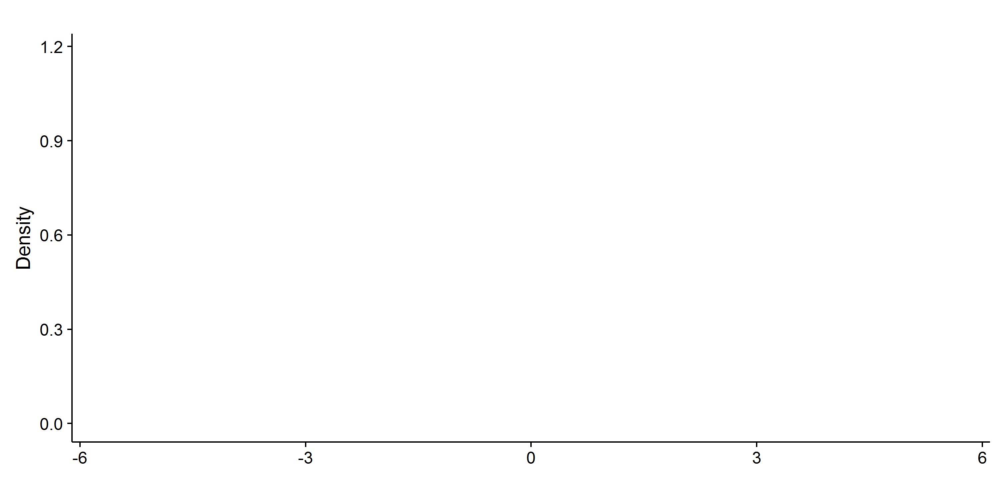

count: false

```{r, include = FALSE}
if (!requireNamespace("pacman")) install.packages("pacman")
if (!requireNamespace("devtools")) install.packages("devtools")
if (!requireNamespace("gganimate")) devtools::install_github("dgrtwo/gganimate")
if (!requireNamespace("uolvid")) devtools::install_github("ellessenne/uolvid")

pacman::p_load("gganimate", "ggplot2", "fastGHQuad", "dplyr", "tidyr", "knitr", "stringr", "xtable", "uolvid")
opts_chunk$set(echo = FALSE, dpi = 300, message = FALSE, warning = FALSE)
```

# Outline

1. <p> Introduction and methods </p>

--

2. Simulation study: analytic formulae vs Gaussian quadrature

--

3. Simulation study: survival models with log-normal frailties

--

4. Application with R

--

5. Discussion

---
class: center, middle, inverse
count: false
# Introduction and methods

---
# Models with intractable terms

* <p>Survival model with shared frailty term:</p>

$$h_{ij} = h_0 (t) \exp(\beta ^ T Z_{ij} + v_i),$$
$$L_i = \int_{-\infty} ^ {+\infty} \prod_{j = 1} ^ {n_i} \left[ h_{ij}(x_{ij}) \right] ^ {\Delta_{ij}} \exp \left[ -\int_0 ^ {x_{ij}}  h_{ij}(t) \ d t \right] f_{\theta}(v_i) \ d v_i$$

--

* <p>Joint model for longitudinal and survival data:</p>

$$h(t | M_i(t), w_i) = h_0 (t) \exp(\gamma ^ T w_i + \alpha m_i(t)),$$
$$L_i = \int_{-\infty} ^ {+\infty} P(T_i, d_i | b_i; \theta_t) \left[ \prod_{j = 1} ^ {n_i} P(y_i(t_{ij}) | b_i; \theta_y) \right] P(b_i; \theta_{b_i}) \ db_i$$

???

The likelihood of many modern statistical models often includes terms that are analytically intractable, such a survival models with frailties, and joint models for longitudinal and survival data. 
Joint model likelihood: integral of survival submodel P(T_i, d_i) x mixed model P(y_i(t_ij)) x random effects distribution P(b_i).

---
# Estimation options

* <p>The expectation-maximisation [EM] algorithm:</p>

> E step: calculate E[ll(&theta;| X, Z)] given &theta;<sup>t</sup>

> M step: find argmax(E[ll(&theta;| X, Z)]) = &theta;<sup>t+1</sup>

???

The EM method requires effort in coding the E-M steps; in the E-step, the unknown random effects are treated as missing values.

--

* <p>Bayesian approach, using Markov Chain Monte Carlo [MCMC] techniques:</p>

> Choose prior distributions for the model parameters

> Derive posterior distributions for the model parameters

--

* <p>Direct likelihood maximisation:</p>

> Likelihood can be easily evaluated

> Many general purpose optimisers are available

???

If closed-form MLEs are not available for a model but the (log-)likelihood can easily be evaluated, one should, before doing anything more sophisticated, simply use a general-purpose numerical optimiser in an attempt to maximise that likelihood, subject to any constraints that there may be on parameters. If that succeeds, there will be no need to derive and code the E and M steps in order to implement the EM algorithm.

---
# Gaussian quadrature

> In numerical analysis, a quadrature rule is an approximation of the definite integral of a function, usually stated as a weighted sum of function values at specified points within the domain of integration.

--

n-point quadrature rule: 

$$\int_{-1} ^ {+1} f(x) \ dx = \sum_{i = 1} ^ n w_i f(x_i)$$
???

n-point quadrature rule yields an exact approximation for polynomials of degree 2n - 1 or less

--

If we rewrite $f(x)$ as $f(x)=\omega(x)g(x)$, weights and nodes $w_i'$ and $x_i'$ that depend on $\omega(x)$ may give better results:

$$\int_{-1} ^ {+1} f(x) \ dx = \int_{-1} ^ {+1} \omega(x)g(x) \ dx = \sum_{i = 1} ^ n w_i' g(x_i')$$

A common weighting function is $\omega(x) = e ^ {- x ^ 2}$, which yields the so-called Gauss-Hermite quadrature rule.

???
g(x) approximately polynomial
omega(x) known
w_i: weights
x_i: nodes

---
class: center, middle

```{r, include = FALSE}
ff = function(x) dnorm(x) / exp(-x^2)

gh_rules <- lapply(seq(2, 32, by = 5), function(i) {
  gh = gaussHermiteData(i)
  int = ghQuad(f = ff, rule = gh)
  data.frame(x = gh$x, w = gh$w, degree = i, integral = int)}) %>% 
  bind_rows() %>% 
  mutate(integral = paste("Quadrature integral:", formattable::comma(integral, 10)))

p <- ggplot(gh_rules, aes(x = x, y = w, frame = degree)) + geom_segment(aes(xend = x, yend = 0)) + geom_text(aes(x = -8, y = 1, label = integral), hjust = 0, vjust = 0) + stat_function(fun = dnorm, color = "red", lty = "dashed") + theme_bw() + labs(x = "", y = "")
gganimate(p, filename = "Presentation_files/gh.gif", fps = 2, width = 6, height = 4)
```



---
class: center, middle, inverse
count: false
# Simulation study #1: <br/> Analytic formulae vs Gaussian quadrature

---
# Simulation study #1

.left-column[
### Rationale
]

.right-column[

* <p>Aim: compare estimation procedure using analytic formulae vs using Gaussian quadrature and approximate integrals;</p>

]

---
count: false
# Simulation study #1

.left-column[
### Rationale
]

.right-column[

* <p>Aim: compare estimation procedure using analytic formulae vs using Gaussian quadrature and approximate integrals;</p>

* Parametric survival model with shared frailty:
$$h_{ij}(t_{ij} | \alpha_i) = \alpha_i h_{ij}(t_{ij}) = \alpha_i p \lambda t_{ij} ^ {p - 1} \exp(X_{ij} \beta)$$
]

???
Weibull parametric survival model, with shape parameter p and scale parameter lambda
Proportional hazards parametrisation
Lambda i.e. intercept explicited there

---
count: false
# Simulation study #1

.left-column[
### Rationale
]

.right-column[

* <p>Aim: compare estimation procedure using analytic formulae vs using Gaussian quadrature and approximate integrals;</p>

* Parametric survival model with shared frailty:
$$h_{ij}(t_{ij} | \alpha_i) = \alpha_i h_{ij}(t_{ij}) = \alpha_i p \lambda t_{ij} ^ {p - 1} \exp(X_{ij} \beta)$$

* The cluster-specific contribution to the likelihood is:
$$L_i(\alpha_i) = \alpha_i ^ {D_i} \prod_{j = 1} ^ {n_i} \left[ S_{ij}(t_{ij}) ^ {\alpha_i} \left( h_{ij}(t_{ij}) \right) ^ {d_{ij}} \right]$$
]

---
count: false
# Simulation study #1

.left-column[
### Rationale
]

.right-column[

* <p>Aim: compare estimation procedure using analytic formulae vs using Gaussian quadrature and approximate integrals;</p>

* Parametric survival model with shared frailty:
$$h_{ij}(t_{ij} | \alpha_i) = \alpha_i h_{ij}(t_{ij}) = \alpha_i p \lambda t_{ij} ^ {p - 1} \exp(X_{ij} \beta)$$

* The cluster-specific contribution to the likelihood is:
$$L_i(\alpha_i) = \alpha_i ^ {D_i} \prod_{j = 1} ^ {n_i} \left[ S_{ij}(t_{ij}) ^ {\alpha_i} \left( h_{ij}(t_{ij}) \right) ^ {d_{ij}} \right]$$

* The unconditional contribution to the likelihood is:
$$L_i = \int L_i(\alpha_i) g(\alpha_i) \ d \alpha_i$$
]

---
# Simulation study #1

.left-column[
### Rationale
### Scenarios
]

.right-column[

* <p>Weibull baseline hazard with shape p = 0.5, scale &lambda; = 1, and Gamma frailty;</p>
]

---
count: false
# Simulation study #1

.left-column[
### Rationale
### Scenarios
]

.right-column[

* <p>Weibull baseline hazard with shape p = 0.5, scale &lambda; = 1, and Gamma frailty;</p>

* 1,000 simulations per scenario;
]

---
count: false
# Simulation study #1

.left-column[
### Rationale
### Scenarios
]

.right-column[

* <p>Weibull baseline hazard with shape p = 0.5, scale &lambda; = 1, and Gamma frailty;</p>

* 1,000 simulations per scenario;

* number of clusters: {15, 30, 100, 200}, number of individuals per cluster: {25, 50, 100, 250, 500, 1000};
]

---
count: false
# Simulation study #1

.left-column[
### Rationale
### Scenarios
]

.right-column[

* <p>Weibull baseline hazard with shape p = 0.5, scale &lambda; = 1, and Gamma frailty;</p>

* 1,000 simulations per scenario;

* number of clusters: {15, 30, 100, 200}, number of individuals per cluster: {25, 50, 100, 250, 500, 1000};

* treatment effect: {-0.50, 0.00, 0.50};
]

---
count: false
# Simulation study #1

.left-column[
### Rationale
### Scenarios
]

.right-column[

* <p>Weibull baseline hazard with shape p = 0.5, scale &lambda; = 1, and Gamma frailty;</p>

* 1,000 simulations per scenario;

* number of clusters: {15, 30, 100, 200}, number of individuals per cluster: {25, 50, 100, 250, 500, 1000};

* treatment effect: {-0.50, 0.00, 0.50};

* variance of the frailty (&theta;): {0.25, 0.50, 1.00};
]

---
count: false
# Simulation study #1

.left-column[
### Rationale
### Scenarios
]

.right-column[

* <p>Weibull baseline hazard with shape p = 0.5, scale &lambda; = 1, and Gamma frailty;</p>

* 1,000 simulations per scenario;

* number of clusters: {15, 30, 100, 200}, number of individuals per cluster: {25, 50, 100, 250, 500, 1000};

* treatment effect: {-0.50, 0.00, 0.50};

* variance of the frailty (&theta;): {0.25, 0.50, 1.00};

* number of quadrature nodes<sup>1</sup>.footnote[1: Gauss-Laguerre quadrature rule]: {15, 35, 75, 105}.
]

---
# Simulation study #1

.left-column[
### Rationale
### Scenarios
### Convergence
]

.right-column[
```{r}
s_an_vs_gq_summary <- readRDS("r_AF_vs_GQ/s_an_vs_gq_summary.RDS")
```
<center>
```{r}
s_an_vs_gq_summary %>%
  gather(key = key, value = value, 8:75) %>%
  mutate(method = str_sub(key, 1, 2),
         par = str_sub(key, 4, str_length(key))) %>%
  separate(par, c("name", "stat"), sep = "_", extra = "merge") %>%
  mutate(stat = ifelse(is.na(stat), name, stat)) %>% 
  filter(grepl("^convn|^convp", stat)) %>% 
  mutate(stat = ifelse(stat == "convn", "Number", "Proportion")) %>% 
  ggplot(aes(x = method, y = value)) + 
  geom_jitter(height = 0, alpha = 3/4) + 
  geom_boxplot(alpha = 3/4, position = position_dodge(0.8)) + 
  facet_wrap(~ stat, scales = "free_y") + 
  theme_bw() +
  labs(x = "", y = "Convergence")
```
</center>
]

---
# Simulation study #1

.left-column[
### Rationale
### Scenarios
### Convergence
### Bias
]

.right-column[
<center>
```{r}
s_an_vs_gq_summary %>%
  gather(key = key, value = value, 8:75) %>%
  mutate(method = str_sub(key, 1, 2),
         par = str_sub(key, 4, str_length(key))) %>%
  separate(par, c("name", "stat"), sep = "_", extra = "merge") %>%
  mutate(stat = ifelse(is.na(stat), name, stat)) %>% 
  filter(grepl("^bias", stat)) %>% 
  mutate(name = factor(name, levels = c("trt", "theta", "lambda", "p"), labels = c("Treatment effect", "Frailty variance", "Lambda", "P"))) %>% 
  ggplot(aes(x = method, y = value, color = name)) +
  geom_jitter(height = 0, alpha = 3/4) + 
  geom_boxplot(alpha = 3/4, position = position_dodge(0.8)) + 
  scale_color_manual(values = uolvid::get_uol_palette(n = 4)) + 
  theme_bw() + 
  theme(legend.position = c(0, 1), legend.justification = c(0, 1), legend.background = element_blank()) + 
  labs(x = "", y = "Bias", color = "")
```
</center>
]

---
# Simulation study #1

.left-column[
### Rationale
### Scenarios
### Convergence
### Bias
### Coverage probability
]

.right-column[
<center>
```{r}
s_an_vs_gq_summary %>%
  gather(key = key, value = value, 8:75) %>%
  mutate(method = str_sub(key, 1, 2),
         par = str_sub(key, 4, str_length(key))) %>%
  separate(par, c("name", "stat"), sep = "_", extra = "merge") %>%
  mutate(stat = ifelse(is.na(stat), name, stat)) %>% 
  filter(grepl("^covp", stat)) %>% 
  mutate(name = factor(name, levels = c("trt", "theta", "lambda", "p"), labels = c("Treatment effect", "Frailty variance", "Lambda", "P"))) %>% 
  ggplot(aes(x = method, y = value, color = name)) +
  geom_jitter(height = 0) + 
  geom_boxplot(alpha = 3/4, position = position_dodge(0.8)) + 
  scale_color_manual(values = uolvid::get_uol_palette(n = 4)) + 
  scale_y_continuous(labels = scales::percent) + 
  theme_bw() + 
  theme(legend.position = c(0, 0), legend.justification = c(0, 0), legend.background = element_blank()) + 
  labs(x = "", y = "Coverage probability", color = "")
```
</center>
]

---
class: center, middle, inverse
count: false
# Simulation study #2: <br/> Parametric survival model with a random effect

---
# Simulation study #2

.left-column[
### Rationale
]

.right-column[

* <p> Aim: estimate a parametric survival model with intractable terms using Gaussian quadrature;</p>
]

---
count: false
# Simulation study #2

.left-column[
### Rationale
]

.right-column[

* <p> Aim: estimate a parametric survival model with intractable terms using Gaussian quadrature;</p>

* Parametric survival model with a random treatment effect:
$$h_{ij}(t_{ij} | b_i) = p \lambda t_{ij} ^ {p - 1} \exp \left[ X_{ij} (\beta + b_i) \right]$$
]

---
count: false
# Simulation study #2

.left-column[
### Rationale
]

.right-column[

* <p> Aim: estimate a parametric survival model with intractable terms using Gaussian quadrature;</p>

* Parametric survival model with a random treatment effect:
$$h_{ij}(t_{ij} | b_i) = p \lambda t_{ij} ^ {p - 1} \exp \left[ X_{ij} (\beta + b_i) \right]$$

* Cluster-specific contribution to the likelihood:
$$L_i = \int_{-\infty} ^ {+\infty} \left[ \prod_{j = 1} ^ {n_i} h_{ij}(t_{ij}) ^ {d_{ij}} S_{ij}(t_{ij}) \right] p(b_i) \ d b_i$$
]

???
Analogously as before, we integrate out the random effects
Likelihood contribution assuming no delayed entry
p(b_i) is the normal density for the random effects
???
---
# Simulation study #2

.left-column[
### Rationale
### Scenarios
]

.right-column[

* <p>Weibull baseline hazard with shape p = 1.5, scale &lambda; = 3, and a random treatment effect;</p>
]

---
count: false
# Simulation study #2

.left-column[
### Rationale
### Scenarios
]

.right-column[

* <p>Weibull baseline hazard with shape p = 1.5, scale &lambda; = 3, and a random treatment effect;</p>

* 1,000 simulations per scenario;
]

---
count: false
# Simulation study #2

.left-column[
### Rationale
### Scenarios
]

.right-column[

* <p>Weibull baseline hazard with shape p = 1.5, scale &lambda; = 3, and a random treatment effect;</p>

* 1,000 simulations per scenario;

* number of clusters: {15, 30, 100, 200}, number of individuals per cluster: {25, 50, 100, 250, 500, 1000};
]

---
count: false
# Simulation study #2

.left-column[
### Rationale
### Scenarios
]

.right-column[

* <p>Weibull baseline hazard with shape p = 1.5, scale &lambda; = 3, and a random treatment effect;</p>

* 1,000 simulations per scenario;

* number of clusters: {15, 30, 100, 200}, number of individuals per cluster: {25, 50, 100, 250, 500, 1000};

* treatment effect: {-0.50, 0.00, 0.50};
]

---
count: false
# Simulation study #2

.left-column[
### Rationale
### Scenarios
]

.right-column[

* <p>Weibull baseline hazard with shape p = 1.5, scale &lambda; = 3, and a random treatment effect;</p>

* 1,000 simulations per scenario;

* number of clusters: {15, 30, 100, 200}, number of individuals per cluster: {25, 50, 100, 250, 500, 1000};

* treatment effect: {-0.50, 0.00, 0.50};

* variance of the random effect (&sigma;<sup>2</sup>): {0.25, 0.50, 1.00};
]

---
count: false
# Simulation study #2

.left-column[
### Rationale
### Scenarios
]

.right-column[

* <p>Weibull baseline hazard with shape p = 1.5, scale &lambda; = 3, and a random treatment effect;</p>

* 1,000 simulations per scenario;

* number of clusters: {15, 30, 100, 200}, number of individuals per cluster: {25, 50, 100, 250, 500, 1000};

* treatment effect: {-0.50, 0.00, 0.50};

* variance of the random effect (&sigma;<sup>2</sup>): {0.25, 0.50, 1.00};

* number of quadrature nodes<sup>2</sup>.footnote[2: Gauss-Hermite quadrature rule]: {15, 35, 75, 105}.
]

---
# Simulation study #2

.left-column[
### Rationale
### Scenarios
### Convergence
]

.right-column[
```{r}
s_normal_gq_summary <- readRDS("r_normal_GQ/s_normal_gq_summary.RDS")
```

<center>
```{r}
s_normal_gq_summary %>%
  gather(key = key, value = value, 8:41) %>%
  mutate(method = str_sub(key, 1, 2),
         par = str_sub(key, 4, str_length(key))) %>%
  separate(par, c("name", "stat"), sep = "_", extra = "merge") %>%
  mutate(stat = ifelse(is.na(stat), name, stat)) %>% 
  filter(grepl("^convn|^convp", stat)) %>% 
  mutate(stat = ifelse(stat == "convn", "Number", "Proportion")) %>% 
  ggplot(aes(x = 1, y = value)) + 
  geom_jitter(height = 0, alpha = 3/4) + 
  geom_boxplot(alpha = 3/4) + 
  facet_wrap(~ stat, scales = "free_y") + 
  theme_bw() +
  theme(axis.ticks.x = element_blank(), axis.text.x = element_blank()) +
  labs(x = "", y = "Convergence")
```
</center>
]

---
# Simulation study #2

.left-column[
### Rationale
### Scenarios
### Convergence
### Bias
]

.right-column[
<center>
```{r}
s_normal_gq_summary %>%
  gather(key = key, value = value, 8:41) %>%
  mutate(par = str_sub(key, 4, str_length(key))) %>%
  separate(par, c("name", "stat"), sep = "_", extra = "merge") %>%
  mutate(stat = ifelse(is.na(stat), name, stat)) %>% 
  filter(grepl("^bias", stat)) %>% 
  mutate(name = factor(name, levels = c("trt", "sigma", "lambda", "p"), labels = c("Treatment effect", "Random effect variance", "Lambda", "P"))) %>% 
  ggplot(aes(x = 1, y = value, color = name)) +
  geom_jitter(height = 0, alpha = 3/4) + 
  geom_boxplot(alpha = 3/4, position = position_dodge(0.8)) + 
  scale_color_manual(values = uolvid::get_uol_palette(n = 4)) + 
  theme_bw() + 
  theme(axis.ticks.x = element_blank(), axis.text.x = element_blank()) +
  theme(legend.position = c(1, 0), legend.justification = c(1, 0), legend.background = element_blank()) + 
  labs(x = "", y = "Bias", color = "")
```
</center>
]

---
# Simulation study #2

.left-column[
### Rationale
### Scenarios
### Convergence
### Bias
### Coverage probability
]

.right-column[
<center>
```{r}
s_normal_gq_summary %>%
  gather(key = key, value = value, 8:41) %>%
  mutate(par = str_sub(key, 4, str_length(key))) %>%
  separate(par, c("name", "stat"), sep = "_", extra = "merge") %>%
  mutate(stat = ifelse(is.na(stat), name, stat)) %>% 
  filter(grepl("^covp", stat)) %>% 
  mutate(name = factor(name, levels = c("trt", "sigma", "lambda", "p"), labels = c("Treatment effect", "Random effect variance", "Lambda", "P"))) %>% 
  ggplot(aes(x = 1, y = value, color = name)) +
  geom_jitter(height = 0, alpha = 3/4) + 
  geom_boxplot(alpha = 3/4, position = position_dodge(0.8)) + 
  scale_color_manual(values = uolvid::get_uol_palette(n = 4)) + 
  theme_bw() + 
  theme(axis.ticks.x = element_blank(), axis.text.x = element_blank()) +
  theme(legend.position = c(1, 0), legend.justification = c(1, 0), legend.background = element_blank()) + 
  labs(x = "", y = "Coverage probability", color = "")
```
</center>
]

---
class: center, middle, inverse
count: false
# Application with R

---
# Application with R

Compute nodes and weights:

```{r, eval = FALSE, echo = TRUE, tidy = TRUE}
# library(fastGHQuad)
gh_rule <- gaussHermiteData(35)
```

--

Write down the log-likelihood function:

```{r, eval = FALSE, echo = TRUE, tidy = TRUE}
mloglik <- function(pars, data) {
  # log-likelihood function here
  return(-ll)
}
```

--

Use a general-purpose optimiser:

```{r, eval = FALSE, echo = TRUE, tidy = TRUE}
out <- optim(fn = mloglik, par = start_parameters, method = "BFGS", hessian = TRUE)
out$stderr <- sqrt(diag(solve(out$hessian)))
```

---
# Discussion

1. <p> Gaussian quadrature works well compared to analytical formulae; </p>

--

2. Gaussian quadrature works well in settings where analytical formulae are not available;

--

3. Direct likelihood maximisation is straightforward to implement.

---
class: back-slide
count: false

# References

* MacDonald IL, _Numerical maximisation of likelihood: a neglected alternative to EM?_. 2014, International Statistical Review, 82(2):296-308;

* Liu Q, and Pierce DA, _A note on Gauss-Hermite quadrature_. 1994, Biometrika, 81(3):624-629;

* Crowther MJ, Look MP, and Riley RD, _Multilevel mixed effects parametric survival models using adaptive Gauss-Hermite quadrature with application to recurrent events and individual participant data meta-analysis_. 2014, Statistics in Medicine, 33(22):3844-3858;

* R Code and slides on my Github page: [https://github.com/ellessenne](https://github.com/ellessenne)
